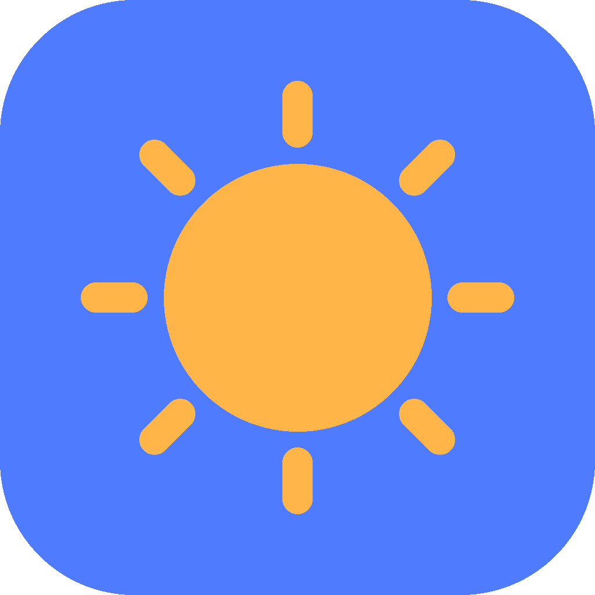

# 하루메이트 (HaruMate)

> **발달장애인·보호자·복지관 실무자 삼자를 연결하는 AI 기반 하루 도우미**
> 서울시자원봉사센터 → 연세대학교 HEART Lab → 독립 출시까지 1인 개발 프로젝트

<p align="center">
  
</p>

<p align="center">
  
  
  
  
</p>

---

## 📖 왜 만들었나

한국 발달장애인 **약 25만 명**, 독거노인 **180만 명**. 지원 인력과 도구는 턱없이 부족하다.  
AAC 시장은 글로벌 $2.58B (CAGR 11.3%)로 성장 중이지만 한국 **발달장애인 특화 통합 앱은 공백**에 가깝다.

하루메이트는 이 공백에 대한 **단독 개발자의 제안**이다.

---

## ✨ 주요 기능

| 범주 | 기능 |
|---|---|
| 🤖 **AI** | Gemini·Groq 기반 자연어 일정 자동 생성 · 맥락 기반 도우미 대화 |
| 📅 **일정** | 단계별 활동 · 존댓말 20-45자 문장 · TTS 음성 안내 |
| 🎬 **추천** | 활동별 YouTube 자동 추천 (장애 강도별 쿼리 조정) |
| 🔔 **알림** | 활동 시작·약 복용·아침 브리핑 로컬 푸시 |
| 📊 **B2B** | 엑셀 3-시트 내보내기 (수행 기록·프로필·주간 요약) |
| 🔗 **동기화** | 코디-당사자 6자리 페어 코드 기반 |
| 🚨 **SOS** | 원터치 가족·복지관·119 연결 |
| 📴 **오프라인** | 네트워크 끊겨도 저장된 일정 유지 |
| ♿ **접근성** | WCAG 2.2 AA · 40px+ 글자 · 3단계 UI 모드 |

---

## 🏗 아키텍처

```
                      ┌─ Gemini 2.0 Flash (primary)
Flutter App ───► Render Backend ─┼─ Groq Llama 3.3 70B (fallback)
(com.harumate.care)   FastAPI    └─ Claude Haiku 4.5 (premium)
     │                   │
     ├─ SQLite (로컬 DB)  ├─ SQLite (일정·waitlist·errors)
     ├─ SharedPreferences├─ Edge TTS (무료 음성합성)
     ├─ flutter_local_notifications
     └─ flutter_tts (오프라인 TTS)
```

**AI 캐스케이드**: 어떤 한 LLM이 장애 일으켜도 다음 계층이 자동 인수.  
→ 실질적 **무한 무료 트래픽 + 절대 다운타임 X**.

---

## 🎨 디자인 시스템

- **Brand**: `docs/brand_identity.md` (컬러·타이포·보이스 v1.0)
- **Figma**: [HaruMate Design System v3.0](https://www.figma.com/design/UR4JMkCsmhZgNmtvznzvv3) · 19 프레임 · 12 토큰
- **Pretendard Variable** 한글 · **Material Symbols Rounded** 아이콘
- **3단계 UI 모드**: 일반 / 간단 / 키오스크 (장애 강도별)
- **4명 페르소나**: 디자이너(유진) · 복지관 팀장(민호) · 어머니(혜경) · 당사자(강민) → [docs/persona_*.txt](docs/)

---

## 📂 프로젝트 구조

```
hi_buddy_app/          ← Flutter 모바일 앱 (메인)
├── lib/
│   ├── screens/       ← 온보딩·홈(역할별)·일정·활동·도우미·프로필
│   ├── services/      ← AI 에이전트·메모리·동기화·엑셀·알림
│   ├── widgets/       ← SOS·활동카드·아침브리핑
│   └── theme/         ← HaruTokens 디자인 토큰
├── test/              ← 유닛 테스트
└── scripts/           ← 키스토어·빌드 자동화

backend/               ← FastAPI (Render 배포)
├── main.py            ← 11 엔드포인트 (AI·TTS·Excel·Auth)
└── errors.db          ← 경량 Crashlytics 대체

docs/                  ← 개인정보처리방침·페르소나·세일즈 덱
design/                ← 프로토타입 HTML·아이콘 미리보기
assets/brand/          ← 아이콘·스크린샷·기능 그래픽
scripts/               ← Python 에셋 생성기 (아이콘·스크린샷)
```

---

## 🚀 빠른 시작

### 사용자 (앱 설치)
> Google Play 내부 테스트 중 (2026-04)  
> 정식 공개: 비공개 테스트 14일 + 심사 후 예정

```
https://play.google.com/apps/internaltest/4701073596345010935
```

### 개발자 (로컬 빌드)
```bash
# 1. 백엔드
cd backend
pip install -r requirements.txt
cp .env.example .env  # GEMINI_API_KEY, GROQ_API_KEY 등 채우기
uvicorn main:app --reload

# 2. 앱
cd hi_buddy_app
flutter pub get
flutter run --dart-define=API_BASE_URL=http://localhost:8000
```

### 테스트
```bash
cd hi_buddy_app
flutter test            # 유닛 테스트
flutter analyze         # 정적 분석
```

---

## 📊 개발 여정

| 단계 | 시기 | 내용 |
|---|---|---|
| Phase 1 · 봉사단 | 2025.03 ~ 08 | 서울청년기획봉사단 2기 **온쉐어 팀장** · AI 쿠킹챗봇 **OnCook** 단독 개발 · 서부장애인종합복지관 발달장애인 5명과 쿠킹클래스 2회 · LG Hello Vision 지원금 · 헬로TV 뉴스 보도 |
| Phase 2 · 연세대 납품 | 2025.12 | 연세대 사회복지대학원 **HEART Lab** 기술개발자 유급 합류 · Streamlit 웹 프로토타입 납품 · AAC 방법론 대학원 강연 |
| Phase 3 · 독립 출시 | 2026.04 | Flutter Android 앱 단독 개발 · v1.3 Play Store 내부 테스트 · 복지관 B2B 세일즈 준비 |

---

## 🎯 로드맵

### ✅ v1.3 (2026.04) — Google Play 내부 테스트 중
- 온보딩 3단계 · 역할 분기 · 세그먼트 웨이트리스트
- AI 일정 자동 생성 · 활동별 YouTube 추천
- 5분 세션 대화 메모리 · 에이전트 캐스케이드
- 엑셀 3-시트 내보내기 · 로컬 푸시 알림
- ErrorReporter (Crashlytics-lite)

### 🔄 v1.4 (2026.05 예정)
- 비공개 테스트 12명 모집 + 14일 운영
- 복지관 시범 도입 2곳
- 실사용 피드백 반영 UX 개선

### 📅 v2.0 (2026.Q3)
- 복지관 **웹 대시보드** (다중 이용자 관리)
- Firebase Auth + 다기기 동기화
- 토스페이먼츠 결제 모듈

### 🌟 v3.0 (2027)
- **하루메이트 시니어** (노인 돌봄 서브 브랜드)
- 대중교통 API 연동 · 외출 알림
- iOS 버전

---

## 💰 수익 구조

| 티어 | 대상 | 월 가격 | 포함 |
|---|---|---|---|
| 무료 | 당사자·보호자 | ₩0 | 모든 기능 |
| **기관** | 복지관·특수학교 | **₩150,000** | 무제한 이용자 + 엑셀 리포트 + 기술 지원 |
| 공공 | 지자체·복지부 | 협의 | 바우처 연동 + 커스텀 기능 |

→ **B2C는 깔때기, B2B 복지관에서 실제 수익.** 2026년 상반기 **시범 기관 2곳 무료** 모집.

---

## 🔒 개인정보 보호

- 모든 개인 데이터는 **사용자 기기에만** 저장 (SQLite + SharedPreferences)
- AI 처리 시 서버로 전송되는 대화는 **영구 저장 안 함** (처리 후 폐기)
- **HTTPS 암호화** 전송
- [개인정보처리방침](https://ryanahn533.github.io/Hibuudy/privacy-policy.html)

---

## 🛠 기술 스택

**Mobile**: Flutter 3.35+ · Dart 3 · Material 3 · Pretendard Variable  
**State**: `setState` (Riverpod/BLoC는 v2.0에서)  
**Storage**: SQLite (`sqflite`) · SharedPreferences  
**Backend**: FastAPI · Python 3.11 · SQLite · Render $7/월  
**AI**: Gemini 2.0 Flash · Groq Llama 3.3 70B · (옵션) Claude Haiku 4.5  
**TTS**: Edge TTS 7.x · flutter_tts  
**Export**: `excel` 4.x · `share_plus` 10.x  
**Notifications**: `flutter_local_notifications` 18.x

---

## 🤝 기여 & 문의

- 🐛 **버그 리포트**: GitHub Issues
- 💬 **일반 문의**: wnsdud2689@gmail.com
- 🏢 **복지관 도입 문의**: 동일 이메일 · 3개월 시범 무료
- 🎓 **연구 협업**: 연세대 HEART Lab 경유 or 위 이메일

---

## 📜 라이선스

MIT License · 코드 자유 사용 가능. 앱 자체는 단독 소유.

---

## 👤 개발자

**안준영 (Junyoung Ahn / Ryan)**  
1인 개발 · 기획 · 디자인 · 백엔드 · 프론트엔드 · 마케팅 · 사업화 전체 단독 수행.

<p align="center">
  <sub>🤖 이 README는 Claude (Anthropic)와 공동 작성됨.</sub>
</p>
