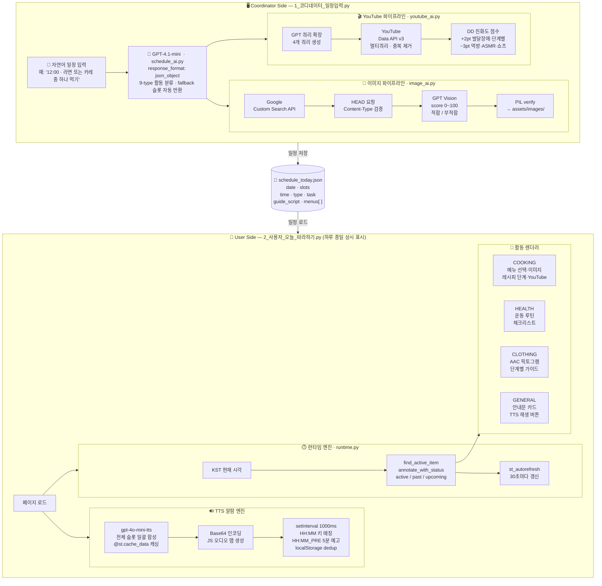

# Hi-Buddy · 발달장애인 자립생활 지원 AI 챗봇

> AI-assisted daily life support chatbot for individuals with developmental disabilities — combining LLM-driven scheduling, assistive AAC interface design, and real-time voice prompting.

**연세대학교 사회복지대학원 HEART Lab × 한국연구재단(NRF) 공동연구지원사업 제출 프로토타입**

---

## Research & Engineering Focus

This project explores how LLM-based systems can support independent daily living for individuals with developmental disabilities by combining:

- **LLM-driven schedule structuring** — natural language → structured JSON activity slots via GPT
- **Assistive AAC interface design** — 40px+ fonts, single-activity views, pictogram support
- **Automated multimedia guidance** — food image retrieval with GPT Vision filtering, DD-friendly YouTube ranking
- **Real-time voice prompting** — pre-rendered TTS embedded as Base64 audio, triggered by a JS clock without Streamlit reruns

The system demonstrates how AI can act as a **cognitive assistant** in accessibility-focused human-AI interaction — not a one-size-fits-all app, but a coordinator-customizable daily guide designed around each user's needs.

---

## 배경 및 동기

### 1단계 — 서울청년기획봉사단 온쉐어 (2025.03 ~ 08)

팀장으로 활동하며 발달장애인을 위한 AI 요리 챗봇 **온쿡(OnCook)** 을 단독 개발하고 현장에 투입했습니다.

- 서부장애인종합복지관 자립주거팀 발달장애인 5명 대상 쿠킹클래스 2회 진행
- LG Hello Vision 기업 연계, 헬로TV 뉴스 취재
- 참여자 만족도 **4.83 / 5점** · SNS 조회수 **16,000회 이상**

### 2단계 — 연세대학교 사회복지대학원 HEART Lab 연구팀 합류 (2025.12)

봉사단 결과보고서를 접한 **연세대학교 사회복지대학원 HEART Lab** 에서 연락이 와,
AI·공학 전문가 / 기술개발자 포지션으로 유급 연구팀에 합류했습니다.

- **한국연구재단(NRF) 2026년도 인문사회분야 공동연구지원사업** 과제 제출에 기여
- 연구계획서에 Hi-Buddy가 팀 개발 프로토타입으로 명시됨
- LLM + AAC(보완대체의사소통) 기술 접목 방법론을 연구팀 대상으로 발표

### 3단계 — Hi-Buddy 개발 (현재)

온쿡 쿠킹 챗봇에서 확장하여, **발달장애인의 하루 전체를 지원하는 일정 관리 앱**으로 발전시켰습니다.
기존 AI 자립지원 서비스의 세 가지 한계(획일화 · 일방향성 · 비포괄성)를 해결하는 방향으로 설계했습니다.

---

## 시스템 아키텍처



**Two-sided 구조**: 코디네이터(설계자)와 사용자(발달장애인)가 완전히 분리된 화면을 사용합니다.
코디네이터는 일정을 설계하고, 사용자 화면은 하루 종일 켜두는 방식으로 운용됩니다.

---

## 핵심 기술 구현

### 1. LLM 기반 일정 자동 생성 (`utils/schedule_ai.py`)

자연어 일정 텍스트를 GPT에 넣어 구조화된 JSON 슬롯으로 변환합니다.

```
입력: "12:00 · 라면 또는 카레 중 하나 먹기"
출력: {
  "time": "12:00",
  "type": "COOKING",
  "task": "라면 또는 카레 중 하나 먹기",
  "guide_script": ["지금은 점심 식사 시간이에요.", ...]
}
```

- `response_format={"type": "json_object"}` 강제로 JSON 파싱 오류 최소화
- 9가지 활동 타입 분류 (MORNING_BRIEFING / COOKING / HEALTH / CLOTHING / LEISURE / ROUTINE / GENERAL / NIGHT_WRAPUP / REST)
- 활동 타입별 키워드 힌트를 시스템 프롬프트에 포함해 분류 정확도 확보
- GPT 응답 실패 시 fallback 슬롯 자동 반환

### 2. 정시 TTS 알람 — JS 임베딩 방식 (`pages/2_사용자_오늘_따라하기.py`)

Streamlit의 한계(rerun 없이 오디오 재생 불가)를 우회하는 방식으로 구현했습니다.

```
페이지 로드 시:
  모든 슬롯의 TTS를 미리 합성 → Base64 인코딩
  → JS 오디오 맵으로 페이지에 임베딩
  → setInterval(1000ms)로 현재 HH:MM 체크
  → 해당 키 있으면 알람 → TTS 순차 재생

중복 방지: localStorage에 "played" 플래그 기록 (날짜 기준 키)
```

- `@st.cache_data`로 TTS 합성 결과 캐싱 (불필요한 API 호출 방지)
- iOS autoplay 제한 우회: `audio_unlocked` 세션 상태 + 무음 WAV 재생 패턴
- 5분 전 예고 알람 지원 (`HH:MM_PRE` 키로 별도 TTS 생성)

### 3. 음식 이미지 검색 및 자동 필터링 (`utils/image_ai.py`)

```
Google Custom Search API (이미지 검색)
  ↓ URL별 HEAD 요청 → Content-Type 검증
  ↓ 통과한 URL만 GPT Vision에 전송
GPT Vision (멀티이미지 한 번에 처리)
  ↓ 각 이미지에 score(0~100) + label(적합/부적합) 부여
  ↓ score≥60 & label=적합 기준 정렬
PIL verify() → 로컬 assets/images/ 저장
```

3단계 검증(URL → Content-Type → PIL)으로 깨진 이미지, 비이미지 URL을 모두 필터링합니다.

### 4. 발달장애 친화 유튜브 영상 검색 (`utils/youtube_ai.py`)

단순 키워드 검색이 아닌 GPT 쿼리 확장 + 규칙 기반 재정렬을 결합했습니다.

```python
# 1단계: GPT로 검색 쿼리 확장 (4개 생성)
base_query = "라면 요리 발달장애 쉬운 설명 따라하기 단계별"
gpt_queries = _generate_youtube_queries_with_gpt(base_query, domain="cooking")

# 2단계: 쿼리별 YouTube API 검색 후 중복 제거
raw_results = _search_youtube_via_api_multi(queries, per_query_max=4)

# 3단계: DD 친화도 점수 계산 후 재정렬
# +2pt: "발달장애", "쉬운", "단계별" 등 포지티브 키워드
# -3pt: "먹방", "ASMR", "쇼츠" 등 네거티브 키워드
ranked = _rerank_for_dd(raw_results, domain="cooking")
```

### 5. 현재 활성 슬롯 계산 (`utils/runtime.py`)

```python
# KST 기준 현재 시각으로 활성/다음/지난 슬롯 판별
active, next_item = find_active_item(schedule, now_time)
annotated = annotate_schedule_with_status(schedule, now_time)
# → status: "active" | "past" | "upcoming"
```

UI는 30초마다 autorefresh, 음성 알람은 JS 1초 타이머로 분리 운용합니다.

---

## 접근성 설계 원칙 (AAC 기반)

발달장애인이 **지원 없이 혼자** 사용할 수 있도록 AAC 원칙을 적용했습니다.

| 영역 | 적용 원칙 |
|------|---------|
| UI | 폰트 40px 이상, 버튼 전체 너비, 화면당 활동 1개 |
| 언어 | 존댓말, 문장 20~45자, 숫자는 한글로 풀어쓰기 |
| 레시피 | 칼 최소화(가위/손 대체), 약불/중불만, 단계별 1동작 |
| 음성 | 정시 자동 TTS + 각 단계 개별 재생 버튼 |
| 이미지 | 메뉴별 실사 이미지, AAC 픽토그램 지원 |

---

## 기술 스택

| 영역 | 기술 |
|------|------|
| Frontend | Streamlit 1.51, streamlit-autorefresh |
| LLM-based Planning | OpenAI GPT-4.1-mini — structured schedule generation, guide script authoring, query expansion |
| Multimodal Filtering | GPT Vision — automated image relevance scoring (0–100) |
| TTS Cognitive Cue System | gpt-4o-mini-tts → Base64 → JS Audio (Streamlit rerun 없이 정시 재생) |
| Image Retrieval | Google Custom Search API + 3-stage validation (URL · Content-Type · PIL) |
| Video Retrieval | YouTube Data API v3 + GPT query expansion + DD friendliness reranking |
| Data Layer | schedule_today.json (날짜별 슬롯 구조) |

---

## 프로젝트 구조

```
Hi-Buddy.py                  # 메인 진입점 (홈 화면 + 바로가기)
pages/
  1_코디네이터_일정입력.py    # 일정 설계 화면 (코디네이터용)
  2_사용자_오늘_따라하기.py   # 따라하기 화면 (사용자, 상시 표시)
utils/
  schedule_ai.py             # 자연어 → JSON 슬롯 변환 (GPT)
  image_ai.py                # 이미지 검색 · GPT Vision 필터 · 로컬 저장
  youtube_ai.py              # 유튜브 검색 · GPT 쿼리 확장 · DD 점수 재정렬
  tts.py                     # TTS 합성 (gpt-4o-mini-tts)
  recipes.py                 # 초간단 레시피 DB + 운동 루틴
  runtime.py                 # 현재 활성 슬롯 탐색 · 타임라인 상태 계산
  config.py                  # API 키 관리 (OpenAI / Google / YouTube)
  topbar.py                  # 공통 상단 헤더 컴포넌트
data/
  schedule_today.json        # 저장된 오늘 일정
  menu/, tools/, hand/       # AAC 이미지 에셋
assets/images/               # 코디네이터가 선택한 음식 사진 (동적 저장)
```

---

## Demo

| Coordinator — 일정 설계 화면 | User — 따라하기 화면 |
|---|---|
|  |  |

> 스크린샷을 추가하려면 `assets/images/demo_coordinator.png` · `demo_user.png` 경로에 이미지를 넣어주세요.

---

## 실행 방법

```bash
# 1. 의존성 설치
pip install -r requirements.txt

# 2. 환경변수 설정 (.env 또는 Streamlit secrets)
OPENAI_API_KEY=sk-...
GOOGLE_API_KEY=...
GOOGLE_CSE_ID=...
YOUTUBE_API_KEY=...

# 3. 실행
streamlit run Hi-Buddy.py
```

---

## 관련 활동

| 활동 | 기간 | 내용 |
|------|------|------|
| 서울청년기획봉사단 온쉐어 팀장 | 2025.03 ~ 08 | AI 챗봇 단독 개발, 발달장애인 쿠킹클래스 현장 투입 |
| 연세대 사회복지대학원 HEART Lab 연구팀 | 2025.12 | 유급 합류, NRF 공동연구지원사업 국책과제 기여, 기술 발표 |
| 헬로TV 뉴스 취재 | 2025.08 | 발달장애인 AI 챗봇 건강 밥상 교실 보도 |
